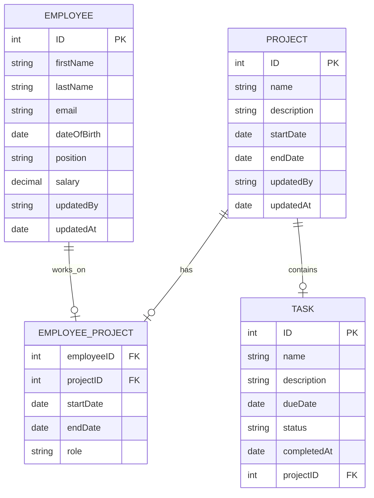

You're right in that **Task** cannot exist without a **Project**, but the **Employee** to **Task** relationship still exists implicitly through the **Project**. The **0..n** relationship you mentioned between **Employee** and **Task** (i.e., an employee can have 0 to many tasks assigned, but only through projects) should still be reflected in the database and ER diagram, but it doesn't need to be directly represented with a link between **Employee** and **Task**.

### Explanation:
- **Task** always belongs to a **Project** (via `FK: Project.ID`).
- **Employee** works on **Tasks**, but not directly; they are linked through **Project** (via `FK: Employee.ID` in the **EmployeeProject** association table).
- **EmployeeProject** manages the assignment of **Employees** to **Projects**. Since **Task** is part of **Project**, employees are indirectly linked to **Tasks** through their association with **Projects**.

### Simplified Database Structure:

1. **Employee**
   - `PK: ID`
   - Other employee attributes (e.g., `firstName`, `lastName`, etc.)

2. **Project**
   - `PK: ID`
   - Other project attributes (e.g., `name`, `description`, etc.)

3. **Task**
   - `PK: ID`
   - `FK: Project.ID`
   - Other task attributes (e.g., `name`, `status`, etc.)

4. **EmployeeProject** (Association Table)
   - `FK: Employee.ID`
   - `FK: Project.ID`
   - `startDate`, `endDate`, `role`, etc.

### ER Diagram Consideration:
In the ER diagram, you'd show the relationships like this:

- **Employee** and **Project** are connected via **EmployeeProject** (many-to-many, as an employee can work on multiple projects).
- **Project** and **Task** are connected (one-to-many, as a project can have many tasks).
- **Employee** and **Task** aren't directly linked because the employee's task assignments are represented through the **Project**. Instead, you can indicate that **Employee** works on tasks **indirectly** through **Project**.

### ER Diagram Overview:
- **Employee** (1) → **EmployeeProject** (n) → **Project** (1) → **Task** (n)

### Simplified Model:
The **0..n** relationship between **Employee** and **Task** exists, but it is mediated by **Project**. While **Task** itself doesn't directly associate with **Employee** in the database (due to the **Project** intermediary), you can still understand that an **Employee** might be associated with multiple tasks by being involved in multiple projects.

### Conclusion:
So, while there is no direct link between **Employee** and **Task** in the database schema, the **Employee** to **Task** relationship still exists indirectly through the **Project**. This relationship is understood through the **EmployeeProject** association, and you would represent the **Employee** to **Task** relationship as a "0..n" relationship in your conceptual model, but not with a direct line in the ER diagram between **Employee** and **Task**.

You're right — in the ER diagram I provided, I mistakenly included a direct relationship between **Employee** and **Task**, which contradicts the idea that the relationship should be mediated by **Project**.

To correctly represent the **Employee** to **Task** relationship through **Project**, **Employee** and **Task** should **not** be directly connected. Instead, the connection should be via **EmployeeProject** and **Project**.

Here is the corrected version of the Mermaid ER diagram, removing the direct link between **Employee** and **Task** and keeping the correct indirect association:

### Explanation of Changes:
- The direct link between **Employee** and **Task** has been removed because **Employee** is indirectly linked to **Task** via **Project**.
- **EMPLOYEE_PROJECT** acts as the intermediary between **Employee** and **Project**.
- **PROJECT** is linked to **TASK**, and tasks belong to a project, which means the **Employee** works on tasks indirectly through the project.

This now correctly represents the model where an employee is associated with a task through their assignment to a project, without directly linking **Employee** to **Task**.