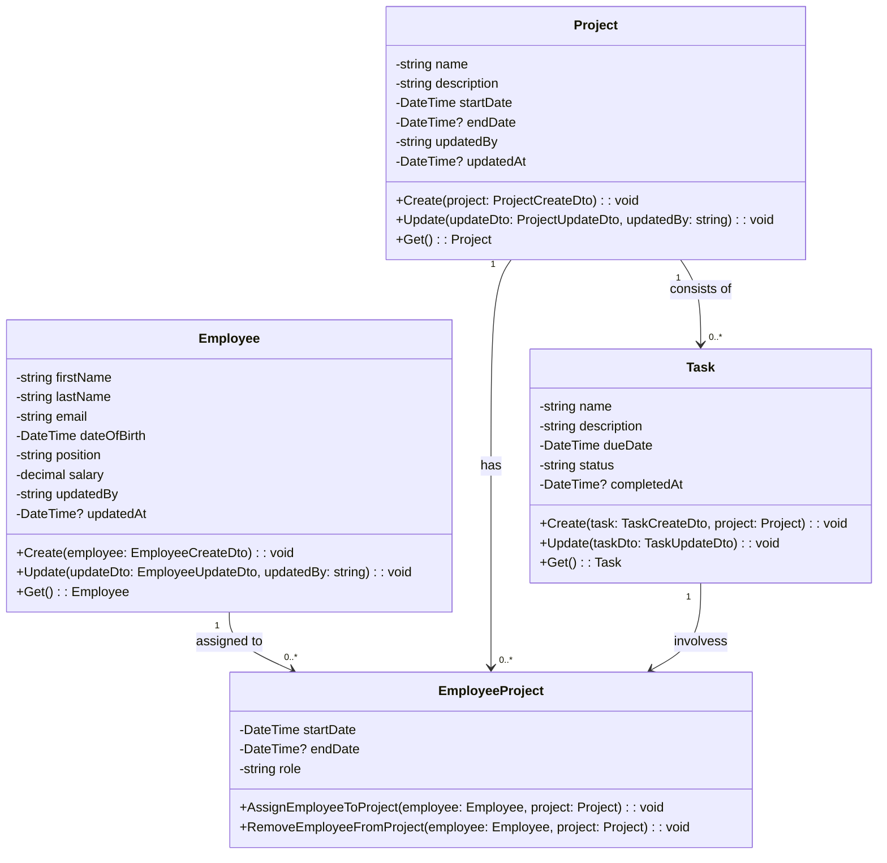

# Review

Show a line between Employee and Project and a dotted line from that line that goes to EmployeeProject
Project 'consists of' Task not 'contains'
Add constraints not null to the db diagram
EmployeeProject
Show the link between Task and EmployeeProject