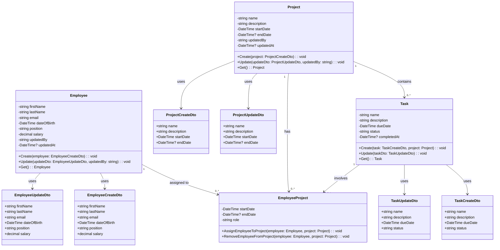

If you are managing the relationships between **Employee**, **Project**, and **Task** using the **EmployeeProject** association class (which already connects **Employee** and **Project**), then you do not need additional association classes like `AssignTaskToProject`. 

Here's the reasoning:

### Employee-Project Relationship
- **EmployeeProject** already handles the relationship between **Employee** and **Project**. This class tracks which employee is working on which project, including details such as the employee's role, start and end dates, etc.

### Project-Task Relationship
- The **Project** class directly contains the **Task** objects (since a project can have multiple tasks). Therefore, there is no need for a separate class to handle this relationship unless you want additional functionality or business rules for task management within a project.

### Task-Employee Relationship
- The relationship between **Task** and **Employee** is mediated via the **Project**. **EmployeeProject** indirectly handles this by associating employees with projects, and since tasks are part of a project, employees working on tasks are already captured via their assignment to a project.

### Summary:
- **EmployeeProject** is the only association class needed, as it handles the many-to-many relationship between **Employee** and **Project**. 
- **Task** is associated with **Project**, and through **Project**, it is indirectly linked to **Employee** (because employees are assigned to projects).
- No need for additional association classes like `AssignTaskToProject` or others.

Here is the simplified Mermaid UML class diagram with only the **EmployeeProject** association class:

### Key Points:
- The **EmployeeProject** association class captures the relationship between **Employee** and **Project**. 
- **Task** objects are related directly to **Project** and can be indirectly linked to **Employee** through their participation in **EmployeeProject**.
- There is no need for additional association classes for **Task** or **Project** since the relationships are already represented through the existing classes.

This simplified model should work for many common use cases involving **Employee**, **Project**, and **Task** relationships.